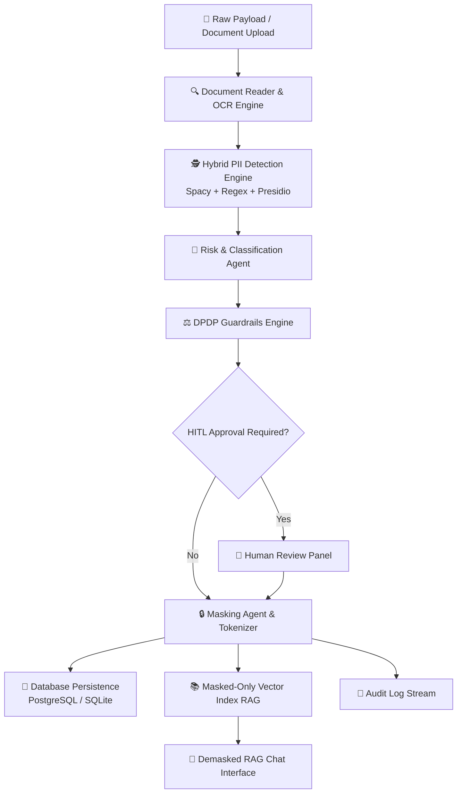

# 🛡️ PrivacyShield AI: Enterprise Privacy Operations & PII Protection Engine

[](https://nextjs.org/)
[](https://fastapi.tiangolo.com/)
[](https://python.org)
[](https://langchain.com)
[]()

**PrivacyShield AI** is an enterprise-grade data privacy operations platform. It provides automated PII (Personally Identifiable Information) detection, contextual risk classification, DPDP Act 2025 guardrail enforcement, Human-in-the-Loop (HITL) approval workflows, and secure **masked-only RAG (Retrieval-Augmented Generation)** document ingestion.

---

## 🌟 Key Features

* **🛡️ Contextual PII Detection & Tokenized Redaction**: Automatically identifies Names, Emails, Phone Numbers, SSNs, Credit Cards, and financial details, replacing them with reversible, document-scoped tokens (`<NAME_1>`, `<EMAIL_1>`, `<SSN_1>`).
* **📊 Privacy Exposure Meter & Risk Classifier**: Computes real-time privacy exposure scores ($0 - 100$) and categorizes document sensitivity (e.g., HR, Financial, Legal) with AI confidence ratings.
* **⚖️ DPDP Act 2025 & GDPR Compliance Guardrails**: Built-in regulatory policy enforcement checking data minimization, consent boundaries, and mandatory review triggers.
* **👤 Human-in-the-Loop (HITL) Workflow**: Interactive entity review interface allowing compliance officers to approve, override, or add custom redaction entities before persistence.
* **🤖 Masked-Only RAG Retrieval Agent**: Enables zero-leakage enterprise chat across vector indexes. Raw PII never touches external LLM providers (e.g., Groq Cloud / Llama 3.3).
* **📜 Immutable DPDP / GDPR Audit Trail**: Complete PostgreSQL-backed audit log stream recording event types (`DETECTION`, `MASKING`, `QNA_QUERY`), processing latencies, and user identities.

---

## 🏗️ System Architecture & Data Flow



---

## 📁 Repository Structure

```text
PS_v5/
├── backend/
│   ├── app/
│   │   ├── agents/            # LangGraph Privacy Agents (PII, Risk, RAG, Audit)
│   │   ├── api/v1/            # FastAPI Endpoints (/pii, /audit, /documents)
│   │   ├── core/              # Config, Security, & Async Database Engine
│   │   ├── models/            # SQLAlchemy Database Models
│   │   └── schemas/           # Pydantic Schemas
│   ├── run_backend.py         # FastAPI Uvicorn Server Launcher
│   └── run_backend_guarded.cmd# Backend Guarded Windows Script
├── frontend/
│   ├── src/
│   │   ├── app/               # Next.js App Router Page Layouts
│   │   ├── components/        # Dark-themed UI Components (Live Redaction, RAG Chat, Audit Stream)
│   │   └── lib/               # API Clients & Utilities
│   └── public/                # Assets & Branding Logos
├── start_privacyshield.bat    # One-click Dual Server Launcher
└── PRIVACYSHIELDAI_RISK_CLASSIFICATION_MASKING_GUIDE.md
```

---

## 🚀 Quick Start Guide

### Prerequisites
* **Node.js** (v18+)
* **Python** (3.11 or 3.12)
* **Groq Cloud API Key** (for Llama-3.3 inference)

### 1. Environment Configuration

Create a `.env` file in the root directory (or in `backend/.env`):

```ini
# Core API Settings
PROJECT_NAME="PrivacyShieldAI Enterprise SaaS"
VERSION="4.0.0"
API_V1_STR="/api/v1"
SECRET_KEY="super-secret-enterprise-key-privacyshield-ai-2026"

# Database Configuration (PostgreSQL / SQLite fallback)
DATABASE_URL="sqlite+aiosqlite:///./privacyshield.db"

# LLM & Observability Credentials
GROQ_API_KEY="your_groq_api_key_here"
LANGCHAIN_TRACING_V2=true
LANGCHAIN_API_KEY="your_langchain_api_key_here"
LANGCHAIN_PROJECT="Privacy-Shield"

# Frontend Public API Endpoint
NEXT_PUBLIC_API_URL="http://127.0.0.1:8000/api/v1"
```

### 2. Manual Server Execution

#### Backend Setup (FastAPI):
```bash
cd backend
python -m venv .venv
# Activate venv:
# Windows: .venv\Scripts\activate
# Linux/macOS: source .venv/bin/activate
pip install -r requirements.txt
python run_backend.py
```
*Backend runs on `http://127.0.0.1:8000` (Swagger docs available at `http://127.0.0.1:8000/docs`).*

#### Frontend Setup (Next.js):
```bash
cd frontend
npm install
npm run dev
```
*Frontend app runs on `http://localhost:3000`.*

---

## ⚡ One-Click Startup (Windows)

To start both backend and frontend servers simultaneously:
```cmd
start_privacyshield.bat
```

---

## 🔌 API Reference Highlights

| Endpoint | Method | Description |
| :--- | :--- | :--- |
| `/api/v1/pii/redact` | `POST` | Analyze raw text/documents, run PII detection, compute exposure score & preview tokens. |
| `/api/v1/pii/mask` | `POST` | Apply approved entity masks, persist mapping, and ingest into vector RAG store. |
| `/api/v1/audit/logs` | `GET` | Retrieve immutable compliance audit logs with filtering by event type. |
| `/api/v1/documents` | `GET` | List vector-indexed documents available for demasked RAG querying. |

---

## 📄 License & Compliance

PrivacyShield AI is released under the **MIT License**. Designed for enterprise compliance under the **Digital Personal Data Protection (DPDP) Act 2025** and **EU GDPR**.
