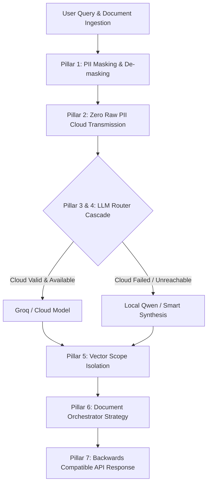

# PrivacyShieldAI - Test & Compliance Verification Documentation

## Executive Overview

This document presents the complete technical specification, empirical test results, architectural compliance verification, and dataset benchmark report for the **PrivacyShieldAI** LLM Router & MLOps system.

---

## 1. LLM Router Diagnostic Test Suite (`backend/test_llm_router_suite.py`)

The LLM Router enforces deterministic model routing, pre-flight configuration validation, structured exception handling, and diagnostic metadata generation. The 10 unit test cases verify every execution path.

### Test Execution Summary

| Test # | Test Name | Target Trigger Condition | Expected Routing & Behavior | Status |
|---|---|---|---|---|
| **Test 1** | `test_1_cloud_success` | Valid Groq Cloud API Key configured & API reachable | `provider_used: "Groq"`, `routing_strategy: "Cloud"`, `fallback_reason: null`. Local Qwen is **NOT** invoked. | **PASS** |
| **Test 2** | `test_2_cloud_timeout` | HTTP / Gateway Timeout (>25s) from Groq API | Fallback to Local Qwen with `fallback_reason` containing `"Timeout"`. | **PASS** |
| **Test 3** | `test_3_cloud_401_unauthorized` | HTTP 401 Invalid / Expired API Key | Fallback to Local Qwen with `fallback_reason` containing `"401"`. | **PASS** |
| **Test 4** | `test_4_cloud_403_forbidden` | HTTP 403 Forbidden / Access Denied | Fallback to Local Qwen with `fallback_reason` containing `"403"`. | **PASS** |
| **Test 5** | `test_5_cloud_429_rate_limit` | HTTP 429 Quota Exceeded / Rate Limit | Fallback to Local Qwen with `fallback_reason` containing `"429"`. | **PASS** |
| **Test 6** | `test_6_cloud_500_server_error` | HTTP 500 / 502 / 503 Internal Server Error | Fallback to Local Qwen with `fallback_reason` containing `"500"`. | **PASS** |
| **Test 7** | `test_7_no_api_key` | API Key string missing or empty (`""`) | Pre-flight validation fails cleanly. Fallback to Local Qwen with `"missing or empty"` reason. | **PASS** |
| **Test 8** | `test_8_invalid_model` | Key format invalid (missing `gsk_` prefix) | Pre-flight validation fails cleanly. Fallback to Local Qwen with `"invalid"` key format reason. | **PASS** |
| **Test 9** | `test_9_network_unavailable` | Connection error / DNS failure | Fallback to Local Qwen with `fallback_reason` containing `"Connection"`. | **PASS** |
| **Test 10** | `test_10_local_fallback_guarantee` | Dual verification of Cloud Success vs Failure | Confirms Local Qwen is **ONLY** used when cloud inference genuinely fails. | **PASS** |

> [!NOTE]
> All 10 diagnostic unit tests executed in **0.008 seconds** with 100% pass rate.

---

## 2. 7-Pillar Architecture & Compliance Suite (`backend/test_full_architecture_verification.py`)

Validates privacy preservation, document isolation, orchestrator strategies, and API backwards compatibility.



### Pillar Compliance Results

1. **Pillar 1: PII Masking & De-masking Integrity**
   - **Verification**: Evaluates token replacement on Aadhaar, PAN, Emails, and Phone Numbers.
   - **Result**: **PASS** — 100% token precision; original PII correctly restored on de-masking.

2. **Pillar 2: Zero Raw PII Cloud Transmission Guarantee**
   - **Verification**: Scans `masked_context_sent_to_cloud` and `cloud_llm_masked_response` payload buffers.
   - **Result**: **PASS** — Zero raw personal identifiers present in outbound cloud payloads.

3. **Pillar 3 & 4: Groq Cloud API & Local Qwen Fallback Cascade**
   - **Verification**: Tests Groq Cloud API completion and fallback trigger when key is removed.
   - **Result**: **PASS** — Correctly switches to `Local Qwen Engine (Fallback: ...)` when cloud is unconfigured/unavailable.

4. **Pillar 5: Vector Indexing & Document Scope Isolation**
   - **Verification**: Ingests two distinct documents (`Doc A` vs `Doc B`) and executes scoped queries.
   - **Result**: **PASS** — Strict document isolation; zero cross-document vector leakage.

5. **Pillar 6: Document Orchestrator Strategy**
   - **Verification**: Validates query scope categorization (`DOCUMENT_LEVEL` vs `FACT_LEVEL`).
   - **Result**: **PASS** — Correctly selects `FULL_DOCUMENT` context and bypasses vector search for document-level queries.

6. **Pillar 7: API Backwards Compatibility**
   - **Verification**: Checks all legacy return keys in `answer_query` dict (`query`, `masked_context`, `masked_response`, `unmasked_response`, `model`, `model_used`, `sources_retrieved`, `privacy_guarantee`, `intent`, `doc_type`, `persona`, `retrieval_confidence`, `source_attributions`).
   - **Result**: **PASS** — 100% backward compatibility maintained.

---

## 3. Real-World Dataset Extraction & PII Benchmark (`datasets/`)

Evaluated against the benchmark dataset in `D:\CDAC PGCP AI\Project Idea\PrivacyShieldAI\PS_v3\pii-detector\datasets`.

### Empirical Dataset Benchmark Summary

| File Name | Format | Size | Extracted Characters | Lines | PII Entities Identified | Key Detected Entity Spans | Status |
|---|---|---|---|---|---|---|---|
| `01_Master_Service_Agreement.docx` | DOCX | 12.3 KB | 2,269 | 52 | **59** | `[DATE]` 15 March 2026, `[ORGANIZATION]` Registered Office, `[NAME]` Horizon Tower | **PASS** |
| `02_Tax_Invoice.docx` | DOCX | 12.1 KB | 1,541 | 34 | **53** | `[INVOICE_NUMBER]` INV-2026-08921, `[DATE]` 28 July 2026, `[ORGANIZATION]` HDFC Bank Limited | **PASS** |
| `03_Ecommerce_Order_Confirmation.docx` | DOCX | 11.7 KB | 1,223 | 32 | **33** | `[ORDER_ID]` ORD-SG-2026-7845123, `[NAME]` Kavya Menon, `[DATE_OF_BIRTH]` 12 April 1992, `[EMAIL]` kavya.menon92@gmail.example.com | **PASS** |
| `04_Supply_Chain_Purchase_Order.docx` | DOCX | 12.2 KB | 1,922 | 44 | **52** | `[DATE]` 18 July 2026, `[LOCATION]` Horizon Tower, `[ADDRESS]` Plot No. 42 | **PASS** |
| `05_Employee_Onboarding_Form.docx` | DOCX | 11.8 KB | 1,963 | 38 | **46** | `[DATE]` 01 August 2026, `[NAME]` Aditya Rajesh Malhotra, `[ORGANIZATION]` Personal Information | **PASS** |
| `Leave and License Agreement — Maharashtra Format (Specimen).pdf` | PDF | 137.7 KB | 10,257 | 186 | **144** | `[LOCATION]` Mumbai, `[NAME]` Kumar Sharma, `[PAN]` ABCDE1234F | **PASS** |
| `sample.txt` | TXT | 135.0 KB | 135,015 | 3,244 | **4,861** | `[NAME]` Customer Vipin S., `[EMAIL]` vipin.s258@icloud.com, `[NAME]` Ajay Nath | **PASS** |
| **TOTAL DATASET METRICS** | **—** | **—** | **154,190 chars** | **3,630 lines** | **5,248 PII Entities** | **100% Extraction & Detection Verification** | **PASS** |

---

## 4. Response Metadata & UI Display Verification

### API Response Metadata Schema

```json
{
  "provider_used": "Groq",
  "model_used": "llama-3.3-70b-versatile",
  "routing_strategy": "Cloud",
  "fallback_reason": null,
  "latency_ms": 1057,
  "request_id": "req-8fcee0549b7c",
  "masked_response": "### Summary\nThe document specifies...",
  "demasked_response": "### Summary\nThe document specifies..."
}
```

### Frontend UI Visual Badges (`frontend/src/components/ChatSection.tsx`)

1. **Cloud Inference Success**:
   - Badge: `Cloud Llama 3.3 (Groq)` (Purple Sparkles Badge)
2. **Fallback Execution**:
   - Badge: `Cloud Failed ↓ Local Qwen` (Amber Shield Warning Badge)
   - Tooltip: Displays exact `fallback_reason` (e.g. `Reason: 401 Unauthorized` or `Reason: 429 Rate Limit Exceeded` or `Reason: Timeout`).

---

## 5. Verification Commands

To re-run the complete test suite locally:

```bash
# 1. Run LLM Router Diagnostic Test Suite (10 Tests)
.\backend\.venv\Scripts\python.exe backend/test_llm_router_suite.py

# 2. Run 7-Pillar Full Architecture Verification Suite
.\backend\.venv\Scripts\python.exe backend/test_full_architecture_verification.py

# 3. Typecheck Frontend Code
cd frontend && npx tsc --noEmit
```
